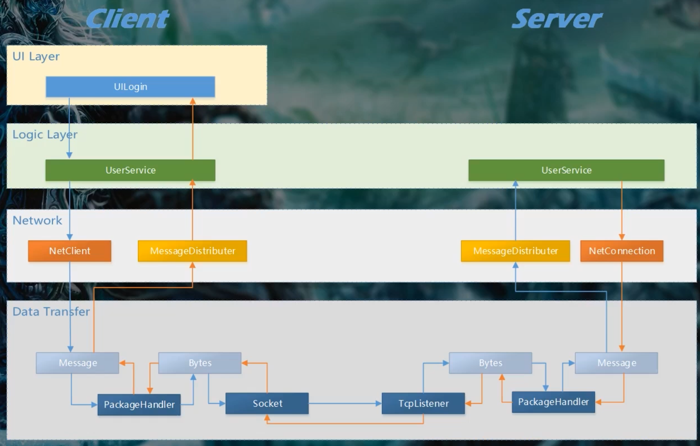

## 2 框架设计

### 设计的流程

- 明确设计目标
- 充分考虑设计方案
- 可行性评估
- 选择最优方案

### 设计的内容

- 游戏玩法设计
- 整体架构设计及方案选择
- 客户端框架设计
- 服务器框架设计
- 工作流程设计

### 设计的阶段

- 整体框架的设计
- 系统方案的设计
- 模块详细设计
- 迭代优化

### 设计的关键

- 整体架构
- 网络通讯及协议
- 数据库及模型
- 服务器架构

### 网络架构图

  

### 服务器架构图

  
  
  
  

### 服务器组架构图

  

### 服务器架构层次结构图

  

- 服务：处理来自客户端的请求。
- 实体：在客户端和服务器中同时存在。
- 模型：只在服务器中存在。
- 管理器：管理模型和实体。

### 服务器模块图

  

核心模块涉及玩家之间的交互。

### 服务器 DB 实体关系

  

### 逻辑实体关系

  

### 角色状态

  

### 角色属性

  

### 消息类型

  

### 游戏系统框架图

  

### 用户登录系统设计

- 客户端
    - UI 设计
        - 注册界面
        - 登录界面
    - 逻辑设计
        - 数据结构
        - 注册流程
        - 登录流程
- 服务器
    - 登录服务
        - 身份验证机制
    - 会话管理
- 协议
    - 协议结构
        - 注册协议
        - 登录协议
    - 协议生成